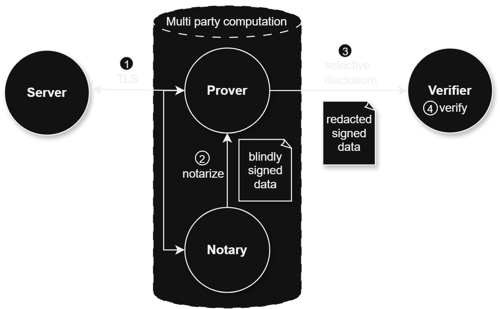

# Super Print Screen

## Motivations

We often see controversies of reported biased response from LLM, search or other web services.

Typically, people will post a screen cap and circulate on social media. However, given the advance of deepfake technologies, integrity of such screenshot is often in doubt.

Given the personalized and private nature, it is hard to verify such response. 

## Solution

Consider we query chat GPT for "Who is the current president of USA"
- With chat GPT API, we create a [Thread](https://platform.openai.com/docs/api-reference/threads/createThread) with the query 
- We are able to retrieve the response via [messages](https://platform.openai.com/docs/api-reference/messages/listMessages) 
- [TLSNotary](https://tlsnotary.org/) can be applied via API to generate zk proof of 
    - It is possible to use a general purposed Notary to create a [portable proof](https://docs.tlsnotary.org/#tls-verification-with-a-general-purpose-notary) that can be verified

- We create an attestation on Base sepolia